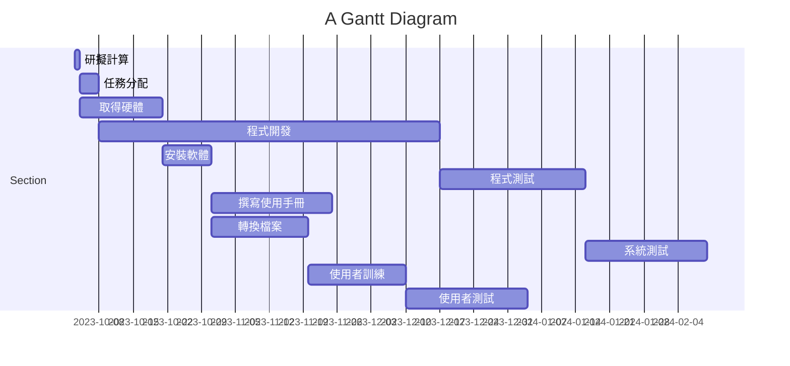

# HW2

# 專案管理

## 甘特圖

```mermaid
gantt
    title A Gantt Diagram

    section Section
    研擬計算 :b1, 2023-10-03, 1d
    任務分配 :b2 ,after b1, 4d
    取得硬體 :b3 ,after b1 , 17d
    程式開發 :b4 ,after b2  , 70d
    安裝軟體 :b5 ,after b3 , 10d
    程式測試 :b6 ,after b4 , 30d
    撰寫使用手冊 :b7 ,after b5 , 25d
    轉換檔案 : b8 ,after b5 , 20d
    系統測試 : b9 ,after b6 , 25d
    使用者訓練 :b10 , after b8 & b7 , 20d
    使用者測試 : b11 , after b10 & b9 , 25d
```

## PERT/CPM圖

